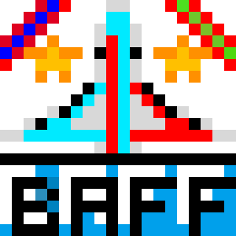

</img>

Hey guys!, MCXIV here! In my initial days of learning java i was very curious about things i could do with this wonderful language. There are a lot of things to mentions here, lemme see if i can cover them all.

First of all, people, this is not one of the repositories which you can easily go to and download the code. What i want to say is that most (97%) of the code is stuffed into one poor little(long) java file. Just to mention, as compared to how i code today, each of my java files are literally smaller than the space in which all variables are declared (in game.java).

Second, i was initially very intrested in making my own games, but was a bit confused about where i should start. In the end an idea hopping like a rabbit came to me and encouraged me to create one of those 2D plane fighter games where it has to defeat incomming enemies.

Finally, i would like to inform that the game is completely made using java and no game engine like GDX( i wish i had though...).

So please first download the game and beat my highscore and lemme know it.

My highscore is aJcv=VaXujhC.

# Features

* All the coding and image works is done by me.. Um, I think it's more appropriate to say in third person. All the boring coding stuff and the pretty intresting pixel art has been done by Minecraftian14. All credits regarding the audio resources goes to thier creators which i have no idea about (found the sound files on my old computer...).

* The game features some useless house flies... Ah, bombing planes as enemies which are ordered to destroy your country. So you have to destroy them before they left the screen . If you wont, slowly they will blast parts of the land, and soon you will lose the mission.

* The game also features a boss fight with a white quad copter which is basically the main fighting unit your opponent has. (he is pretty poor in budget managing, so he only purchased bombers. So watch out for some poorly shot bullets). 

* There is also one green hovering flying machine which actually is still under testing. (The scientists and engineers your enemy has got are all bodge makers. So you may have a harder gameplay here).

* In this game there is also a score keeper, which displays the best 4 of the scores.

* You can also interchange between 3 skins for the plane you would like to drive, along with their own bullet textures.

* Basically, the normal controls are the same WASD or the arrow keys. But you can also force drift the plane towards right or left using E and Q respectively. To shoot a bullet, you'll have to press space, or enter key. You can go to the settings menu and enable mouse controls. If done so, the plane will try to follow below the mouseas accurately as possible using the auto drifter and it's normal controls.

Please let me know how much you liked the game.

# Galary

The usual gameplay with the house flies... er, the bombers.

The quad copter boss.

The unstable one.
